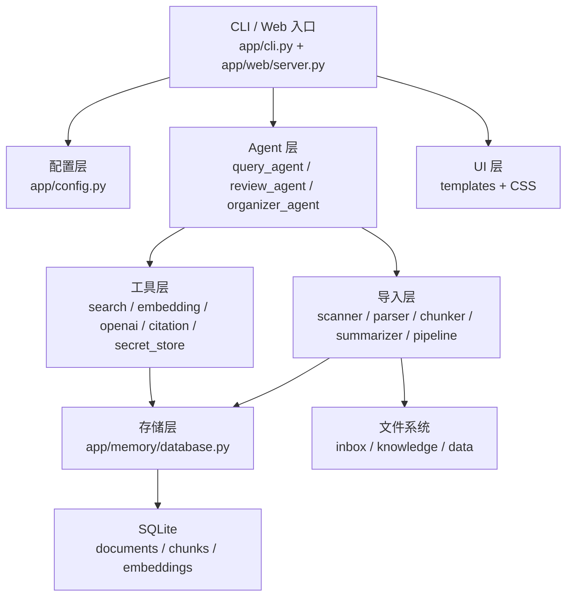
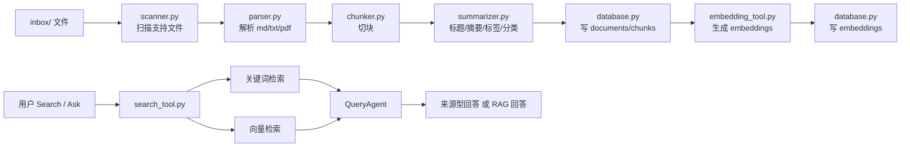
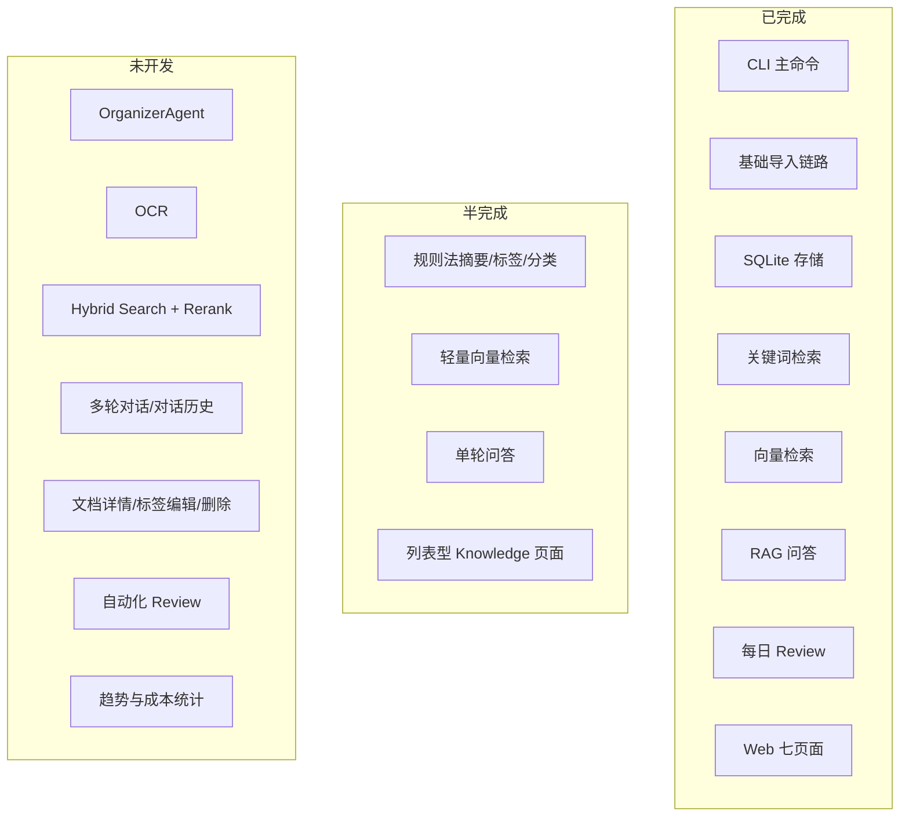

# 项目架构图

## 1. 分层架构图

```mermaid
flowchart TD
    A["CLI / Web 入口<br/>app/cli.py + app/web/server.py"] --> B["配置层<br/>app/config.py"]
    A --> C["Agent 层<br/>query_agent / review_agent / organizer_agent"]
    C --> D["工具层<br/>search / embedding / openai / citation / secret_store"]
    C --> E["导入层<br/>scanner / parser / chunker / summarizer / pipeline"]
    D --> F["存储层<br/>app/memory/database.py"]
    E --> F
    A --> G["UI 层<br/>templates + CSS"]
    F --> H["SQLite<br/>documents / chunks / embeddings"]
    E --> I["文件系统<br/>inbox / knowledge / data"]
```

## 2. 导入与检索数据流

```mermaid
flowchart LR
    A["inbox/ 文件"] --> B["scanner.py<br/>扫描支持文件"]
    B --> C["parser.py<br/>解析 md/txt/pdf"]
    C --> D["chunker.py<br/>切块"]
    D --> E["summarizer.py<br/>标题/摘要/标签/分类"]
    E --> F["database.py<br/>写 documents/chunks"]
    F --> G["embedding_tool.py<br/>生成 embeddings"]
    G --> H["database.py<br/>写 embeddings"]

    I["用户 Search / Ask"] --> J["search_tool.py"]
    J --> K["关键词检索"]
    J --> L["向量检索"]
    K --> M["QueryAgent"]
    L --> M
    M --> N["来源型回答 或 RAG 回答"]
```

## 3. 模块成熟度图

```mermaid
flowchart TB
    subgraph Done["已完成"]
        D1["CLI 主命令"]
        D2["基础导入链路"]
        D3["SQLite 存储"]
        D4["关键词检索"]
        D5["向量检索"]
        D6["RAG 问答"]
        D7["每日 Review"]
        D8["Web 七页面"]
    end

    subgraph Partial["半完成"]
        P1["规则法摘要/标签/分类"]
        P2["轻量向量检索"]
        P3["单轮问答"]
        P4["列表型 Knowledge 页面"]
    end

    subgraph Todo["未开发"]
        T1["OrganizerAgent"]
        T2["OCR"]
        T3["Hybrid Search + Rerank"]
        T4["多轮对话/对话历史"]
        T5["文档详情/标签编辑/删除"]
        T6["自动化 Review"]
        T7["趋势与成本统计"]
    end
```

